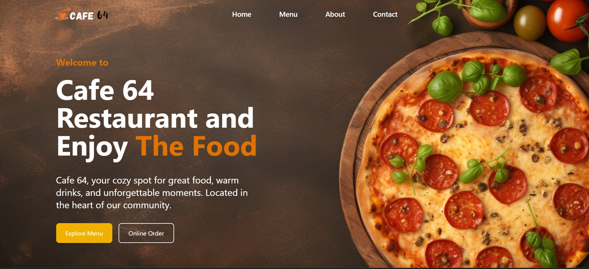

# 🍽️ Cafe 64 – Modern Restaurant Website

  


A fully responsive and modern restaurant website built using **React.js**, **Tailwind CSS**, and **AOS animations**.  
Designed and developed completely **from scratch**, the site delivers a polished UI, smooth transitions, and an optimized user experience on all screen sizes.

---

## 🚀 Live Demo
🔗 **Visit Website:** [https://cafe-64-osld.vercel.app/]

---

## ✨ Features

- 💻 Fully responsive (Mobile, Tablet, Desktop)
- 🎨 Clean modern UI with Tailwind CSS
- 🧩 Reusable components (Navbar, Menu Cards, Footer)
- 🎞️ Animated scrolling powered by AOS
- 🍔 Mobile-friendly hamburger menu
- 🖼️ Grid-based food gallery
- 🧭 Smooth navigation between sections
- ⚡ Fast performance with Vite + React

---

## 🛠️ Tech Stack

**Frontend:**  
- React.js  
- Vite  

**Styling & UI:**  
- Tailwind CSS  
- Custom responsive components  

**Animations:**  
- AOS (Animate On Scroll)

**Hosting:**  
- Vercel  

**Tools & Package Management:**  
- npm  
- Git & GitHub  

---

## ⚙️ Installation & Setup

### 1️⃣ Clone the repository
```bash
git clone https://github.com/Piumalhk/cafe-64.git
cd cafe-64
```
### 2️⃣ Install dependencies
```bash
npm install
```
### 3️⃣ Start development server
```bash
npm run dev
```
### 4️⃣ Build for production
```bash
npm run build
```
---
## 📄 License </p>

This project is licensed under the MIT License